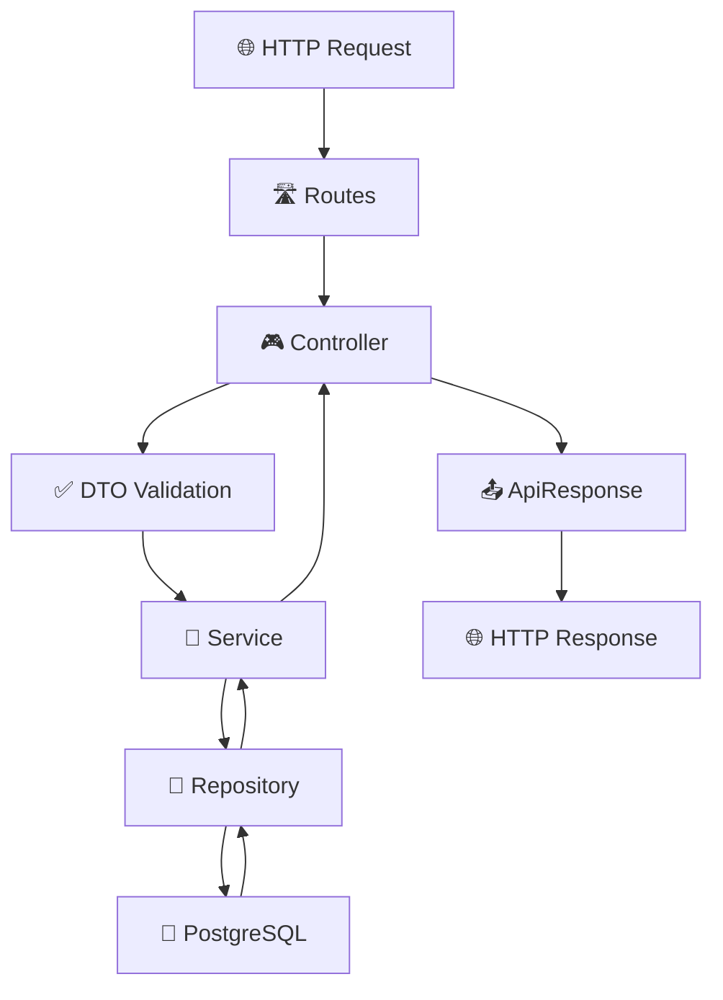

# 🚀 PERN Template Backend

## 📋 Descripción

API REST robusta construida con **PostgreSQL, Express, Node.js y TypeScript** utilizando arquitectura modular limpia, validaciones type-safe y mejores prácticas de la industria.

## 🏗️ Stack Tecnológico

- **⚡ Node.js** + **TypeScript** - Runtime y tipado estático
- **🌐 Express 5** - Framework web minimalista
- **🐘 PostgreSQL 18** - Base de datos relacional
- **📦 TypeORM** - ORM con decoradores y migrations
- **🔒 bcrypt** - Hashing seguro de contraseñas
- **✅ Zod** - Validación de esquemas type-safe
- **🐳 Docker** - Containerización con docker-compose
- **🔧 ts-node-dev** - Hot reload para desarrollo

## 📁 Arquitectura del Proyecto

```
backend/
├── 📂 src/
│   ├── 📂 config/              # Configuración global
│   │   ├── database.ts         # Configuración TypeORM
│   │   └── env.ts              # Variables de entorno + validación Zod
│   │
│   ├── 📂 shared/              # Código compartido entre módulos
│   │   ├── 📂 middlewares/     # Middleware global
│   │   │   └── error-handler.ts
│   │   └── 📂 utils/           # Utilidades compartidas
│   │       └── api-response.ts
│   │
│   ├── 📂 modules/             # Módulos de negocio (Feature-based)
│   │   └── 📂 users/           # Módulo de usuarios
│   │       ├── 📂 controllers/ # Controladores HTTP
│   │       ├── 📂 dto/         # Data Transfer Objects + Validaciones
│   │       ├── 📂 entities/    # Entidades TypeORM
│   │       ├── 📂 repositories/# Acceso a datos (Repository Pattern)
│   │       ├── 📂 routes/      # Definición de rutas
│   │       ├── 📂 services/    # Lógica de negocio
│   │       └── users.module.ts # Configuración del módulo
│   │
│   ├── app.ts                  # Configuración Express
│   └── server.ts               # Punto de entrada
│
├── 📂 dist/                    # Código transpilado (build)
├── docker-compose.yml          # Orquestación de servicios
├── package.json                # Dependencias y scripts
├── tsconfig.json              # Configuración TypeScript
└── .env                       # Variables de entorno
```

## 🎯 Arquitectura Modular Explicada

### 🧩 **Patrón de Módulos**

Cada **módulo** representa un **dominio de negocio** completo y auto-contenido:

```typescript
// Módulo Users - Estructura interna
users/
├── controllers/     # 🎮 Manejo de requests HTTP
├── dto/            # 📋 Validaciones y tipos de entrada/salida  
├── entities/       # 🗃️ Modelos de base de datos (TypeORM)
├── repositories/   # 💾 Acceso a datos (abstracción DB)
├── routes/         # 🛣️ Definición de endpoints
├── services/       # 🔧 Lógica de negocio
└── module.ts       # ⚙️ Configuración y registro del módulo
```

### 🔄 **Flujo de Datos (Request → Response)**



### 📋 **Capas y Responsabilidades**

#### 1. **🛣️ Routes Layer**
```typescript
// Define endpoints y conecta con controllers
router.post("/users", userController.createUser);
router.get("/users/:id", userController.getUserById);
```

#### 2. **🎮 Controllers Layer**
```typescript
// Maneja HTTP requests, valida entrada, llama services
async createUser(req: Request, res: Response) {
  const userData = CreateUserSchema.parse(req.body); // Validación
  const user = await this.userService.createUser(userData);
  res.json(ApiResponse.success(user)); // Respuesta estandarizada
}
```

#### 3. **✅ DTOs Layer** 
```typescript
// Validaciones type-safe con Zod
export const CreateUserSchema = z.object({
  email: z.string().email(),
  password: z.string().min(8).regex(/^(?=.*[A-Z])(?=.*[a-z])(?=.*\d)/),
  firstName: z.string().min(2).max(100)
});
```

#### 4. **🔧 Services Layer**
```typescript
// Lógica de negocio, validaciones complejas, orquestación
async createUser(userData: CreateUserDto): Promise<UserResponseDto> {
  // Verificaciones de negocio
  const existingUser = await this.userRepository.findByEmail(userData.email);
  if (existingUser) throw new Error("Email already exists");
  
  return await this.userRepository.create(userData);
}
```

#### 5. **💾 Repository Layer**
```typescript
// Acceso puro a datos, queries, transacciones
async create(userData: CreateUserDto): Promise<User> {
  const user = this.repository.create(userData);
  return await this.repository.save(user);
}
```

#### 6. **🗃️ Entities Layer**
```typescript
// Modelos de datos, relaciones, validaciones DB
@Entity("users")
export class User {
  @PrimaryGeneratedColumn("uuid")
  id: string;
  
  @Column({ unique: true })
  email: string;
}
```

## 🔧 Configuración y Variables de Entorno

### 📋 **Configuración Type-Safe**

```typescript
// src/config/env.ts - Validación con Zod
const envSchema = z.object({
  NODE_ENV: z.enum(["development", "production", "test"]),
  POSTGRES_HOST: z.string().min(1),
  POSTGRES_PASSWORD: z.string().min(1),
  JWT_SECRET: z.string().min(32)
});

export const env = envSchema.parse(process.env);
```

### 🐳 **Docker Compose**

```yaml
# docker-compose.yml
services:
  db:
    image: postgres:18
    container_name: pg_db
    environment:
      POSTGRES_USER: ${POSTGRES_USER:-postgres}
      POSTGRES_PASSWORD: ${POSTGRES_PASSWORD:-admin123}
      POSTGRES_DB: ${POSTGRES_DB:-pg_db}
    healthcheck:
      test: ["CMD-SHELL", "pg_isready -U postgres"]
    volumes:
      - db_data:/var/lib/postgresql/data
```

## 🚀 Guía de Instalación

### 📦 **1. Prerrequisitos**

```bash
# Verificar versiones
node --version    # >= 18.0.0
npm --version     # >= 9.0.0  
docker --version  # >= 20.0.0
```

### 🔧 **2. Configuración Inicial**

```bash
# Clonar el proyecto
git clone <repository-url>
cd backend

# Instalar dependencias
npm install

# Configurar variables de entorno
cp .env.example .env
# Editar .env con tus valores
```

### 🐳 **3. Base de Datos**

```bash
# Iniciar PostgreSQL con Docker
docker-compose up -d

# Verificar que esté corriendo
docker-compose ps
```

### ⚡ **4. Desarrollo**

```bash
# Modo desarrollo (hot reload)
npm run dev

# El servidor inicia en http://localhost:3000
# Health check: GET /health
```

### 🏗️ **5. Producción**

```bash
# Build del proyecto
npm run build

# Iniciar servidor de producción  
npm start
```

## 📡 API Endpoints

### 🔓 **Endpoints Públicos**

```http
POST /api/users          # Registro de usuario
POST /api/users/login    # Autenticación
GET  /health             # Health check
```

### 🔒 **Endpoints Privados**

```http
GET    /api/users              # Listar usuarios (paginado + filtros)
GET    /api/users/:id          # Obtener usuario por ID
GET    /api/users/profile/:id  # Perfil completo del usuario
GET    /api/users/stats        # Estadísticas de usuarios
PUT    /api/users/:id          # Actualizar usuario
PUT    /api/users/:id/password # Cambiar contraseña
PUT    /api/users/:id/verify-email # Verificar email
DELETE /api/users/:id          # Eliminar usuario (soft delete)
```

### 📋 **Ejemplo de Uso**

```bash
# Crear usuario
curl -X POST http://localhost:3000/api/users \
  -H "Content-Type: application/json" \
  -d '{
    "email": "john@example.com",
    "password": "Password123!",
    "firstName": "John",
    "lastName": "Doe",
    "dateOfBirth": "1990-01-15",
    "gender": "male",
    "phoneNumber": "+1234567890"
  }'

# Respuesta
{
  "success": true,
  "message": "User created successfully",
  "data": {
    "id": "uuid-here",
    "email": "john@example.com",
    "firstName": "John",
    "lastName": "Doe",
    "fullName": "John Doe",
    "isActive": true,
    "createdAt": "2025-10-02T19:30:00.000Z"
  },
  "timestamp": "2025-10-02T19:30:00.000Z"
}
```

## 🛡️ Seguridad Implementada

### 🔐 **Autenticación y Autorización**
- ✅ Hash de contraseñas con **bcrypt** (12 rounds)
- ✅ Validación de contraseñas fuertes (mayúsculas, minúsculas, números)
- ✅ Verificación de email
- ✅ Soft delete para auditoría

### 🛡️ **Headers de Seguridad**
```typescript
app.use((req, res, next) => {
  res.setHeader('X-Content-Type-Options', 'nosniff');
  res.setHeader('X-Frame-Options', 'DENY');
  res.setHeader('X-XSS-Protection', '1; mode=block');
  next();
});
```

### ✅ **Validación de Entrada**
- **Zod schemas** para validación type-safe
- **Sanitización** automática de strings
- **Límites de tamaño** en requests (10MB)
- **Enum validation** para campos específicos

## 🔍 Logging y Monitoreo

### 📊 **Structured Logging**

```typescript
// Error logging con contexto
console.error("❌ Error:", {
  message: error.message,
  stack: isDevelopment() ? error.stack : undefined,
  url: req.url,
  method: req.method,
  timestamp: new Date().toISOString()
});
```

### 📈 **Health Check**

```http
GET /health

{
  "success": true,
  "data": {
    "status": "OK",
    "environment": "development",
    "version": "1.0.0",
    "uptime": 1234.567,
    "timestamp": "2025-10-02T19:30:00.000Z"
  }
}
```

## 🧪 Testing y Desarrollo

### 🔧 **Scripts Disponibles**

```bash
npm run dev      # Desarrollo con hot reload
npm run build    # Build de producción
npm start        # Servidor de producción
npm test         # Tests unitarios (por implementar)
```

### 🐳 **Docker Commands**

```bash
# Gestión de la base de datos
docker-compose up -d          # Iniciar en background
docker-compose down           # Detener servicios
docker-compose logs db        # Ver logs de PostgreSQL
docker-compose exec db psql -U postgres -d pg_db  # Conectar a la DB
```

## 📋 Mejores Prácticas Implementadas

### ✅ **Arquitectura**
- 🎯 **Separation of Concerns** - Cada capa tiene una responsabilidad específica
- 🔄 **Dependency Injection** - Servicios inyectables para testing
- 🧩 **Modular Design** - Módulos auto-contenidos y reutilizables
- 📋 **Repository Pattern** - Abstracción del acceso a datos

### ✅ **Código**
- 🛡️ **Type Safety** - TypeScript estricto en toda la aplicación
- ✅ **Input Validation** - Zod schemas para validación robusta
- 🔐 **Security First** - Headers, hashing, sanitización
- 📝 **Self-Documenting** - Código legible con JSDoc

### ✅ **Base de Datos**
- 🏗️ **Migrations** - Versionado de esquema de DB
- 🔄 **Soft Delete** - Eliminación lógica para auditoría
- 📊 **Indexing** - Índices para optimización de queries
- 🔗 **Relationships** - Relaciones bien definidas con TypeORM

### ✅ **Error Handling**
- 🚨 **Global Error Handler** - Manejo centralizado de errores
- 📋 **Standardized Responses** - Formato consistente de respuestas
- 🔍 **Detailed Logging** - Información contextual para debugging
- 🎯 **HTTP Status Codes** - Códigos semánticamente correctos

## 🔮 Próximas Mejoras

### 🚀 **En Desarrollo**
- [ ] 🔐 JWT Authentication middleware
- [ ] 📧 Email verification system
- [ ] 🧪 Unit & Integration tests
- [ ] 📝 API documentation (Swagger)
- [ ] 🔄 Rate limiting
- [ ] 📊 Monitoring & metrics

### 🎯 **Roadmap**
- [ ] 🔍 ElasticSearch integration
- [ ] 📱 WebSocket support
- [ ] 🌐 GraphQL API
- [ ] 🚀 Redis caching
- [ ] 📋 Admin dashboard
- [ ] 🔄 Event-driven architecture

---

## 🤝 Contribución

### 📋 **Estructura para Nuevos Módulos**

```bash
# Crear nuevo módulo
mkdir -p src/modules/nombre-modulo/{controllers,dto,entities,repositories,routes,services}

# Archivos base requeridos
touch src/modules/nombre-modulo/nombre-modulo.module.ts
touch src/modules/nombre-modulo/README.md
```

### 🎯 **Guidelines**

1. **Seguir la arquitectura modular** establecida
2. **Validar entrada** con Zod schemas
3. **Documentar endpoints** con JSDoc
4. **Implementar tests** unitarios e integración
5. **Mantener consistencia** en naming y estructura

---

**🚀 Desarrollado con las mejores prácticas de Node.js, TypeScript y PostgreSQL**

**📧 Contacto:** Para dudas o contribuciones, abrir issue en el repositorio.

**📄 Licencia:** MIT - Ver archivo LICENSE para detalles.