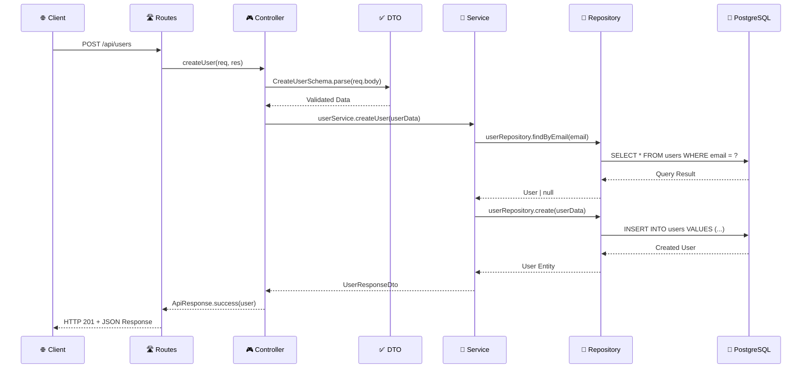

# 🏗️ Guía de Arquitectura Modular

## 📋 Principios Arquitectónicos

### 🎯 **Separation of Concerns (SoC)**
Cada componente tiene una **responsabilidad única y bien definida**:

```
🛣️  Routes      → Definir endpoints y routing
🎮  Controllers → Manejar requests HTTP
✅  DTOs        → Validar y tipar entrada/salida  
🔧  Services    → Implementar lógica de negocio
💾  Repository  → Acceder y manipular datos
🗃️  Entities    → Modelar datos y relaciones
```

### 🧩 **Modular Design**
Cada módulo es **auto-contenido** y representa un **dominio de negocio**:

```typescript
// ✅ CORRECTO: Módulo Users completo
users/
├── controllers/user.controller.ts
├── dto/user.dto.ts  
├── entities/User.ts
├── repositories/user.repository.ts
├── routes/user.routes.ts
├── services/user.service.ts
└── users.module.ts

// ❌ INCORRECTO: Lógica dispersa
src/
├── controllers/user.controller.ts
├── models/User.ts
├── services/user.service.ts
└── routes/users.ts
```

## 🔄 Flujo de Datos Detallado

### 📨 **Request Flow (Cliente → Servidor)**



### 🔄 **Capa por Capa**

#### 1. **🛣️ Routes Layer - Definición de Endpoints**

```typescript
// src/modules/users/routes/user.routes.ts
import { Router } from "express";
import { UserController } from "../controllers/user.controller";

const router = Router();
const userController = new UserController();

// Rutas públicas
router.post("/", userController.createUser);           // Registro
router.post("/login", userController.loginUser);       // Login

// Rutas privadas (requieren auth)
router.get("/", userController.getAllUsers);           // Listar
router.get("/:id", userController.getUserById);        // Por ID
router.put("/:id", userController.updateUser);         // Actualizar
router.delete("/:id", userController.deleteUser);      // Eliminar

export default router;
```

**Responsabilidades:**
- ✅ Definir endpoints HTTP
- ✅ Conectar rutas con controllers
- ✅ Aplicar middleware específico
- ✅ Manejar parámetros de ruta

#### 2. **🎮 Controllers Layer - Manejo de HTTP**

```typescript
// src/modules/users/controllers/user.controller.ts
export class UserController {
  private readonly userService: IUserService;

  /**
   * @route POST /api/users
   * @desc Crear usuario
   */
  createUser = async (req: Request, res: Response, next: NextFunction): Promise<void> => {
    try {
      // 1. Validar entrada con DTO
      const userData = CreateUserSchema.parse(req.body);
      
      // 2. Delegar lógica al service
      const user = await this.userService.createUser(userData);
      
      // 3. Respuesta estandarizada
      res.status(201).json(
        ApiResponse.success(user, "User created successfully")
      );
    } catch (error) {
      // 4. Delegar error handling
      next(error);
    }
  };
}
```

**Responsabilidades:**
- ✅ Parsear requests HTTP
- ✅ Validar entrada con DTOs
- ✅ Llamar services apropiados
- ✅ Formatear respuestas HTTP
- ✅ Manejar errores HTTP específicos

#### 3. **✅ DTOs Layer - Validación Type-Safe**

```typescript
// src/modules/users/dto/user.dto.ts
import { z } from "zod";

// Schema de validación de entrada
export const CreateUserSchema = z.object({
  email: z.string()
    .email({ message: "Invalid email format" })
    .max(255, "Email too long")
    .transform(val => val.toLowerCase().trim()),
    
  password: z.string()
    .min(8, "Password must be at least 8 characters")
    .regex(/^(?=.*[a-z])(?=.*[A-Z])(?=.*\d)/, 
           "Password must contain uppercase, lowercase and number"),
           
  firstName: z.string()
    .min(2, "First name too short")
    .max(100, "First name too long")
    .regex(/^[a-zA-ZÀ-ÿ\s]+$/, "Only letters and spaces allowed")
    .transform(val => val.trim()),
    
  // ... más campos
}).strict(); // No permitir campos extra

export type CreateUserDto = z.infer<typeof CreateUserSchema>;

// Schema de respuesta (sin datos sensibles)
export const UserResponseSchema = z.object({
  id: z.string().uuid(),
  email: z.string().email(),
  firstName: z.string(),
  lastName: z.string(),
  fullName: z.string(),
  isActive: z.boolean(),
  createdAt: z.date(),
  updatedAt: z.date(),
});

export type UserResponseDto = z.infer<typeof UserResponseSchema>;
```

**Responsabilidades:**
- ✅ Validar tipos de entrada
- ✅ Sanitizar y transformar datos
- ✅ Definir contratos de API
- ✅ Generar tipos TypeScript automáticamente
- ✅ Documentar estructura de datos

#### 4. **🔧 Services Layer - Lógica de Negocio**

```typescript
// src/modules/users/services/user.service.ts
export class UserService implements IUserService {
  private readonly userRepository: IUserRepository;

  async createUser(userData: CreateUserDto): Promise<UserResponseDto> {
    // 1. Validaciones de negocio
    const existingUser = await this.userRepository.findByEmail(userData.email);
    if (existingUser) {
      throw new Error("A user with this email already exists");
    }

    // 2. Validaciones complejas
    if (userData.dateOfBirth) {
      const age = this.calculateAge(userData.dateOfBirth);
      if (age < 13) {
        throw new Error("User must be at least 13 years old");
      }
    }

    // 3. Orquestación de operaciones
    try {
      const user = await this.userRepository.create(userData);
      
      // 4. Transformar a DTO de respuesta
      return this.mapToResponseDto(user);
    } catch (error) {
      throw new Error("Failed to create user. Please try again.");
    }
  }

  // Métodos privados de utilidad
  private calculateAge(dateOfBirth: Date): number { /* ... */ }
  private mapToResponseDto(user: User): UserResponseDto { /* ... */ }
}
```

**Responsabilidades:**
- ✅ Implementar reglas de negocio
- ✅ Validaciones complejas y contextuales
- ✅ Orquestar múltiples repositorios
- ✅ Transformar entre DTOs y entidades
- ✅ Manejar transacciones de negocio

#### 5. **💾 Repository Layer - Acceso a Datos**

```typescript
// src/modules/users/repositories/user.repository.ts
export class UserRepository implements IUserRepository {
  private readonly repository: Repository<User>;

  constructor() {
    this.repository = AppDataSource.getRepository(User);
  }

  async create(userData: CreateUserDto): Promise<User> {
    try {
      // 1. Crear instancia de entidad
      const user = this.repository.create({
        email: userData.email,
        password: userData.password, // Se hasheará automáticamente
        firstName: userData.firstName,
        lastName: userData.lastName,
        dateOfBirth: userData.dateOfBirth || null,
        gender: userData.gender || null,
        phoneNumber: userData.phoneNumber || null,
      });

      // 2. Persistir en base de datos
      return await this.repository.save(user);
    } catch (error) {
      // 3. Manejar errores de DB específicos
      if (error instanceof Error && error.message.includes('duplicate key')) {
        throw new Error('Email already exists');
      }
      throw error;
    }
  }

  async findAll(query: UserQueryDto): Promise<{ users: User[]; total: number; pages: number }> {
    // Query builder complejo con filtros
    const queryBuilder = this.repository
      .createQueryBuilder("user")
      .where("user.isActive = :isActive", { isActive: true });

    // Aplicar filtros dinámicos
    if (query.search) {
      queryBuilder.andWhere(
        "(user.firstName ILIKE :search OR user.lastName ILIKE :search)",
        { search: `%${query.search}%` }
      );
    }

    // Paginación
    const [users, total] = await queryBuilder
      .skip((query.page - 1) * query.limit)
      .take(query.limit)
      .getManyAndCount();

    return { users, total, pages: Math.ceil(total / query.limit) };
  }
}
```

**Responsabilidades:**
- ✅ Ejecutar queries de base de datos
- ✅ Implementar filtros y búsquedas
- ✅ Manejar paginación
- ✅ Abstraer detalles específicos de TypeORM
- ✅ Optimizar performance de queries

#### 6. **🗃️ Entities Layer - Modelos de Datos**

```typescript
// src/modules/users/entities/User.ts
@Entity("users")
export class User {
  @PrimaryGeneratedColumn("uuid")
  id: string;

  @Column({ 
    unique: true,
    transformer: {
      to: (value: string) => value?.toLowerCase().trim(),
      from: (value: string) => value
    }
  })
  email: string;

  @Column({ select: false }) // No incluir por defecto en queries
  password: string;

  // Campos con validaciones a nivel DB
  @Column({ length: 100 })
  firstName: string;

  @Column({ type: "date", nullable: true })
  dateOfBirth: Date | null;

  @Column({ 
    type: "enum", 
    enum: ["male", "female", "other", "prefer_not_to_say"],
    nullable: true 
  })
  gender: "male" | "female" | "other" | "prefer_not_to_say" | null;

  // Timestamps automáticos
  @CreateDateColumn()
  createdAt: Date;

  @UpdateDateColumn()
  updatedAt: Date;

  // Propiedades computadas
  get fullName(): string {
    return `${this.firstName} ${this.lastName}`.trim();
  }

  // Métodos de la entidad
  async comparePassword(candidatePassword: string): Promise<boolean> {
    return bcrypt.compare(candidatePassword, this.password);
  }

  // Hooks de lifecycle
  @BeforeInsert()
  async hashPassword() {
    if (this.password) {
      this.password = await bcrypt.hash(this.password, 12);
    }
  }
}
```

**Responsabilidades:**
- ✅ Definir estructura de tabla
- ✅ Mapear campos y tipos de datos
- ✅ Implementar relaciones
- ✅ Hooks de lifecycle (BeforeInsert, etc.)
- ✅ Métodos de la entidad específicos

## 🔄 Intercomunicación Entre Capas

### 📋 **Principios de Dependencia**

```typescript
// ✅ CORRECTO: Dependencias van hacia adentro
Controller → Service → Repository → Entity
     ↓         ↓          ↓
   HTTP     Business    Data      Model
  Layer     Logic      Access     Layer

// ❌ INCORRECTO: Repository no debe conocer Controller
Repository → Controller ❌
Service → Controller ❌
```

### 🔌 **Dependency Injection**

```typescript
// Interfaces para invertir dependencias
export interface IUserService {
  createUser(userData: CreateUserDto): Promise<UserResponseDto>;
  getUserById(id: string): Promise<UserResponseDto>;
}

export interface IUserRepository {
  create(userData: CreateUserDto): Promise<User>;
  findById(id: string): Promise<User | null>;
}

// Inyección en constructor para testing
export class UserService implements IUserService {
  constructor(
    private readonly userRepository: IUserRepository = new UserRepository()
  ) {}
}

export class UserController {
  constructor(
    private readonly userService: IUserService = new UserService()
  ) {}
}
```

## 🏗️ Creación de Nuevos Módulos

### 📋 **Template de Módulo**

```bash
# 1. Crear estructura de carpetas
mkdir -p src/modules/products/{controllers,dto,entities,repositories,routes,services}

# 2. Crear archivos base
touch src/modules/products/products.module.ts
touch src/modules/products/README.md
touch src/modules/products/controllers/product.controller.ts
touch src/modules/products/dto/product.dto.ts
touch src/modules/products/entities/Product.ts
touch src/modules/products/repositories/product.repository.ts
touch src/modules/products/routes/product.routes.ts
touch src/modules/products/services/product.service.ts
```

### 🎯 **Checklist para Nuevo Módulo**

- [ ] **Entity** definida con TypeORM decorators
- [ ] **DTOs** con validaciones Zod completas
- [ ] **Repository** con interfaz e implementación  
- [ ] **Service** con lógica de negocio
- [ ] **Controller** con manejo HTTP
- [ ] **Routes** con endpoints documentados
- [ ] **Module** con configuración y registro
- [ ] **README** con documentación específica
- [ ] **Tests** unitarios e integración
- [ ] **Registrado** en app.ts

### 🔧 **Integración en App Principal**

```typescript
// src/app.ts
import { ProductsModule } from "./modules/products/products.module";

// Inicializar módulos
const usersModule = new UsersModule();
const productsModule = new ProductsModule(); // ← Nuevo módulo

// Registrar rutas
app.use("/api", usersModule.router);
app.use("/api", productsModule.router);      // ← Integrar
```

## 🎯 Beneficios de esta Arquitectura

### ✅ **Mantenibilidad**
- **Código organizado** por dominio de negocio
- **Responsabilidades claras** en cada capa
- **Fácil localización** de bugs y features

### ✅ **Escalabilidad**
- **Módulos independientes** que crecen por separado
- **Equipos paralelos** pueden trabajar en módulos distintos
- **Reutilización** de código entre módulos

### ✅ **Testabilidad**
- **Dependency injection** facilita mocking
- **Capas aisladas** permiten unit tests específicos
- **Interfaces** definen contratos testeable

### ✅ **Flexibilidad**
- **Cambios en una capa** no afectan otras
- **Diferentes implementaciones** (DB, cache, etc.)
- **Migración incremental** de funcionalidades

---

**🚀 Esta arquitectura está diseñada para crecer con tu proyecto, desde MVP hasta aplicaciones enterprise.**